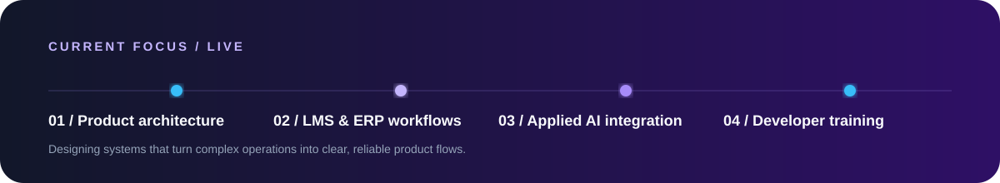

  

  
  
  

  
  

## Product Engineering, Applied AI & Developer Training

I build role-aware web products, operational workflows, and polished client platforms with Next.js, SvelteKit, Node.js, Prisma, and PostgreSQL. My AI work is applied: service integrations, AI-assisted product flows, and n8n automation - not model training.

---

  

  <a href="https://webliquids.com">WebLiquids Campus OS</a> ·
  <a href="https://codeclousor.com">CodeClousor</a> ·
  <a href="https://azuleconstruction.au">Azule Construction</a> ·
  <a href="https://psychowaves.org">PsychoWaves</a> ·
  <a href="https://memantra.in">MeMantra</a> ·
  <a href="https://scoreloom.com">ScoreLoom</a>

  <a href="https://github.com/DhimanKhushal/webcoder">Webcodder</a> ·
  <a href="https://github.com/DhimanKhushal/property-in-vrindavan">Property in Vrindavan</a> ·
  <a href="https://github.com/DhimanKhushal/donerfactorymolndal">Doner Factory Molndal</a>

---

## Stack

  

  
  
  

---

## GitHub Signal

  

  

---

  

---

  

<i>Build systems that make the next good decision easier.</i>

